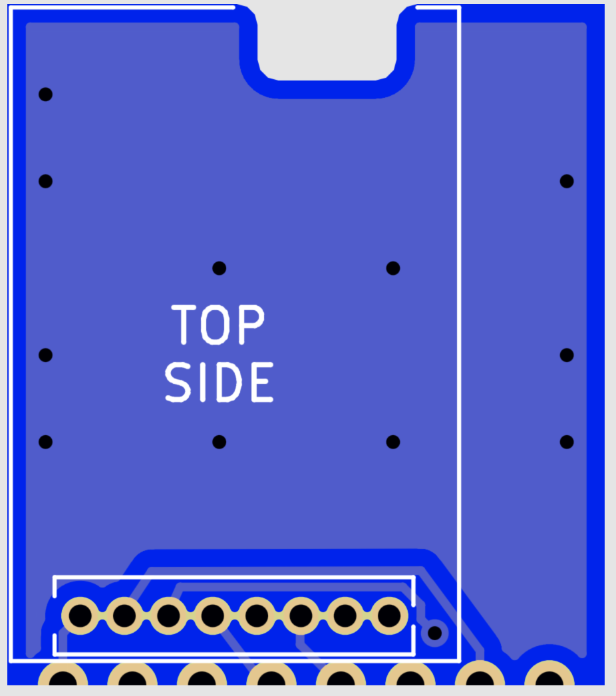

# eByteAdapter für CC1101 Modul-Layouts

#### Adapter, um das EBYTE E07-868MS10 Modul anstelle des CC1101 Moduls zu verwenden, ohne vorhandene (AskSin++)Platinen-Layouts ändern zu müssen.

Die Länge wird jedoch 2mm vergrößert: 
Statt 19mm beim original CC1101 sind es hier nun 21mm. Die Breite entspricht dem CC1101 Modul
  
Weitere Infos siehe https://nurazur.wordpress.com/2020/10/06/tino-mit-cc1101-funkmodul-link-budget/
  
Die Idee zur Platine entstand auf Grundlage des Beitrags von ["Gelegenheitsbastler" im Homematic Forum](https://homematic-forum.de/forum/viewtopic.php?f=76&t=49719&start=130#p653100).
  
Der Diskussionsthread zu dieser PCB im Homematic Forum: https://homematic-forum.de/forum/viewtopic.php?f=76&t=66537
 
**Gerber Download: https://github.com/jp112sdl/eByteAdapter/raw/master/gerber/gerber.zip**

